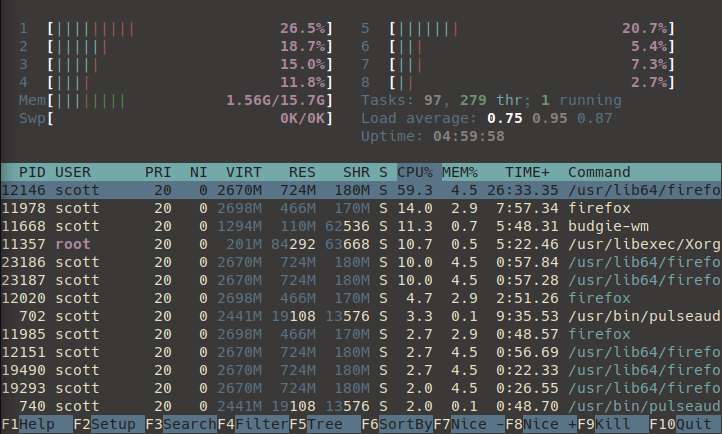
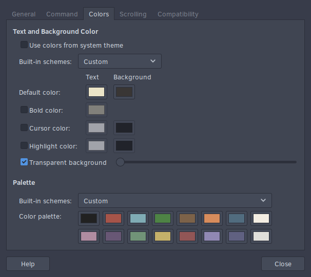

# palenbeige
A terminal theme / colour scheme that focuses on pale, pastel colours and some old-school beige.

For exact Hex colour codes have a look at _palette.md_ for the "accent" colours, and the _bgfg.md_ for the background and foreground colours.

## Some examples:

