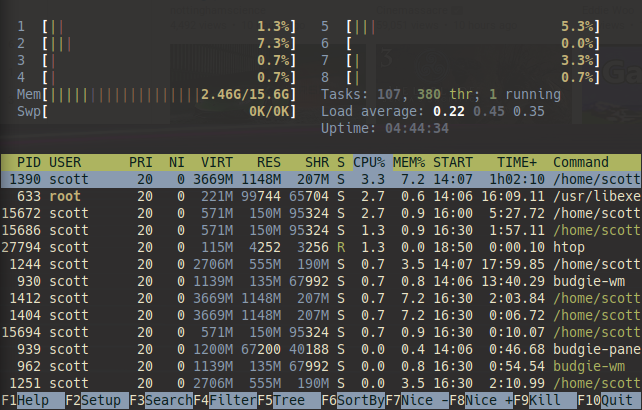

# palenbeige
A terminal theme / colour scheme that focuses on pale, pastel colours and some old-school beige.

I would appreciate it if you link back to this repository if you happen to use the theme in anything public, or you decide to use it as a foundation for a new theme. It has taken me a decent amount of time, trial and error to get this theme to a state that I was happy with it. :)

For exact Hex colour codes have a look at _palette.md_ for the accent colours, and the _bgfg.md_ for the background and foreground colours.

## Some examples:

